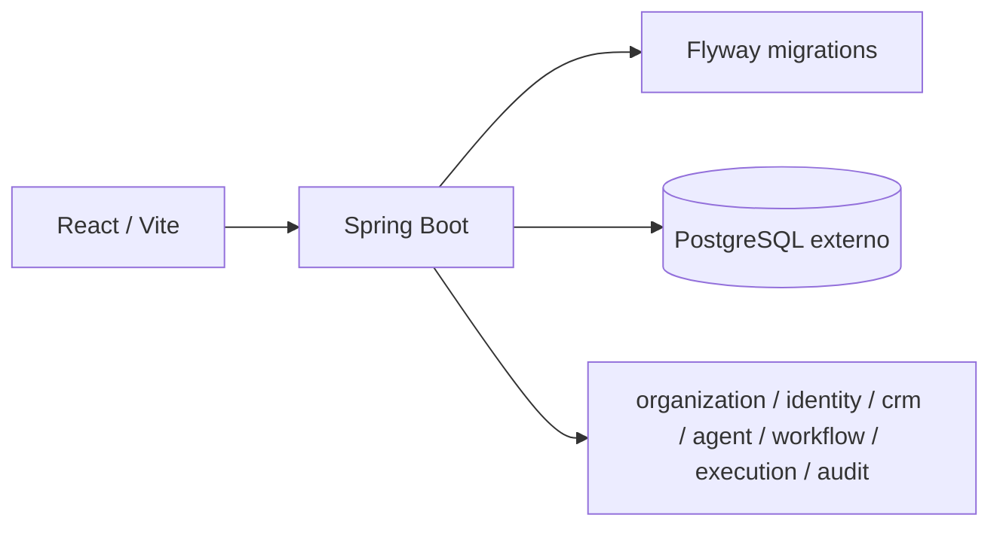

# Arquitetura

ZIN inicia como monolito modular: um deploy backend com modulos de dominio bem separados e um frontend React independente. Isso reduz custo operacional e evita distribuicao prematura antes de existirem limites reais de escala.

## Backend

Pacote raiz `com.zin.platform`, com modulos `shared`, `organization`, `identity`, `crm`, `agent`, `workflow`, `execution` e `audit`. Nesta etapa existem apenas entidades, enums, classes base e configuracao. Nao ha controllers nem services de negocio.

## Frontend

Aplicacao React com dados mockados em `src/mocks`, tipos em `src/types`, componentes reutilizaveis e layout de SaaS operacional. A URL futura do backend e configurada por `VITE_API_BASE_URL`.

## PostgreSQL externo

O Compose nao cria banco. O backend acessa o PostgreSQL do host via `host.docker.internal`, com `extra_hosts` no Linux.

## Direcao futura

Agentes, filas, webhooks, Edge Runner e execucoes distribuidas podem surgir como componentes isolados depois que contratos e volume justificarem. Microsservicos agora adicionariam latencia, deploys acoplados por contrato e complexidade de observabilidade sem ganho proporcional.

