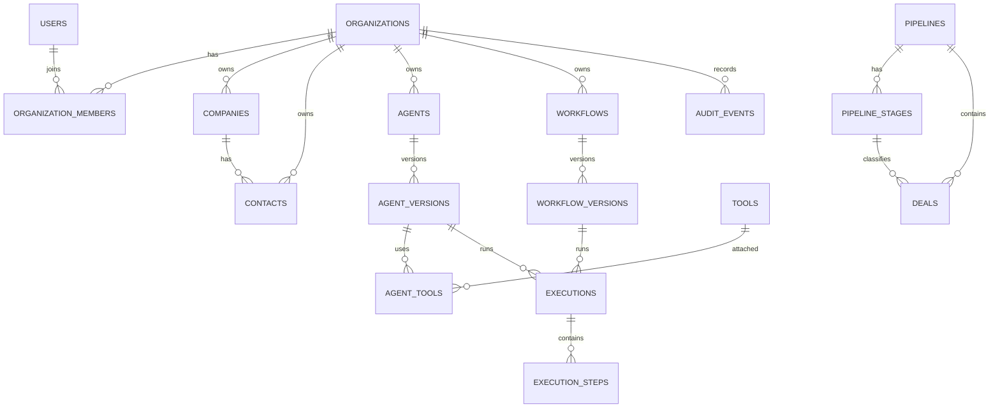

# Banco de dados

O schema usa UUID gerado pela aplicacao, `timestamp with time zone` em UTC, `numeric(19,2)` para dinheiro e `jsonb` para configuracoes, definicoes e payloads.

## Tabelas

Migrations:

- `V1__create_organizations_and_users.sql`
- `V2__create_crm.sql`
- `V3__create_agents.sql`
- `V4__create_workflows.sql`
- `V5__create_executions.sql`
- `V6__create_audit_events.sql`

## Multitenancy

Registros de negocio possuem `organization_id`. Ainda nao ha filtro automatico de tenant; a modelagem prepara o isolamento para as proximas camadas.

## Indices

As migrations criam indices para organizacao, usuario responsavel, status, pipeline, etapa, entidades de execucao, trace id e auditoria. Slugs relevantes possuem unique por organizacao.

## Auditoria

Entidades principais herdam `created_at`, `updated_at` e `version`. Execucoes e eventos de auditoria sao registros append-oriented com `created_at`.

## Migrations

Flyway e a fonte de verdade. `spring.jpa.hibernate.ddl-auto=validate` impede criacao ou atualizacao automatica do schema em runtime.

